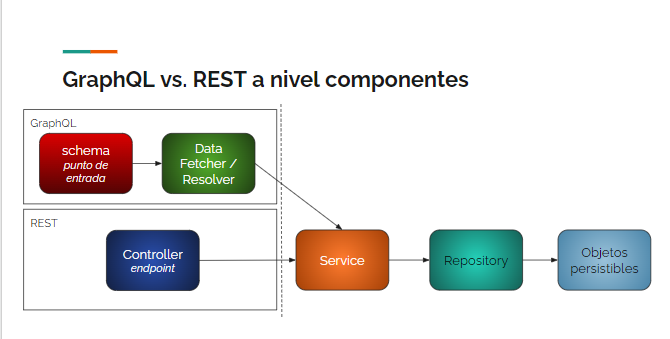

# DEMO de GRAPHQL

## ¿Qué es GraphQL?
Es una especificación de un patrón de comunicación entre un cliente y un servidor

## Proyecto spring-boot en JAVA 11 que implementa [DGS](https://netflix.github.io/dgs/getting-started/) para GRAPHQL

## Dependencias 
Para usar DGS deben agregarse estas dos dependencias dentro de la sección dependencies del archvio build.gradle
``` 
dependencies {
    implementation(platform("com.netflix.graphql.dgs:graphql-dgs-platform-dependencies:latest.release"))
    implementation "com.netflix.graphql.dgs:graphql-dgs-spring-boot-starter"
}
```

## Archivo schema.graphqls
Dentro de la carpeta ./resouces/schema agregar el archivo schema.graphqls. Dentro de este archivo se definen los queries y las mutaciones

### Ejemplo de Query
```
type Query {
    profesores(nombreFilter: String): [Profesor]
    profesor(idProfesor: Int): Profesor
}
```

### Ejemplo de Mutation
```aidl
type Mutation {
    agregarProfesor(profesorInput: ProfesorInput): Profesor
    actualizarProfesor(updateProfesor: UpdateProfesor): Profesor
    agregarMateria(idProfesor: Int, materiaInput: MateriaInput): Profesor
}
```
En este archivo también se agregan los types y lo inputs que se usan en los queries y las mutaciones

## Comentarios
Lo único que se reemplaza de un proyecto spring-boot tradicional es el controller. Las entidades, repositorio y servicios es igual a un servicio REST tradicional.



## Como probarlo
El proyecto levanta una interfaces tipo swagger donde se puede probar los queries y mutaciones. [Interface](http://localhost:8081/graphiql)

### Interface Graphiql


### Postman
Hay que pegarle al siguiente endpoint de la aplicación /graphql con un a POST [EndPoint](http://localhost:8081/graphql)


### Codigo de un query
```aidl
query {
  profesores {
    id,
    nombre,
    apellido,
    materias {
      nombre,
      codigo,
      cargaHoraSemanal
    }
  }
}
```
### Codigo de un mutacion
```aidl
mutation {
  agregarProfesor( profesorInput: {
    nombre: "Juan Roman",
    apellido: "Riquelme",
    anioComienzo: 1990,
    puntajeDocente: 100
  } 
  ){
	id,
    nombre,
    apellido,
    anioComienzo,
    puntajeDocente,
    materias {
      codigo,
      nombre
    }
  }
}
```

## Creditos
**Fernando Dodido** canal de youtube diseño para todys. Link al [video](https://www.youtube.com/watch?v=HcnFi2wYjnQ&t=1139s)